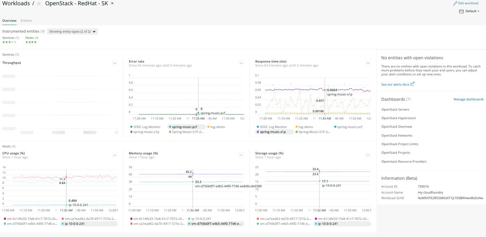
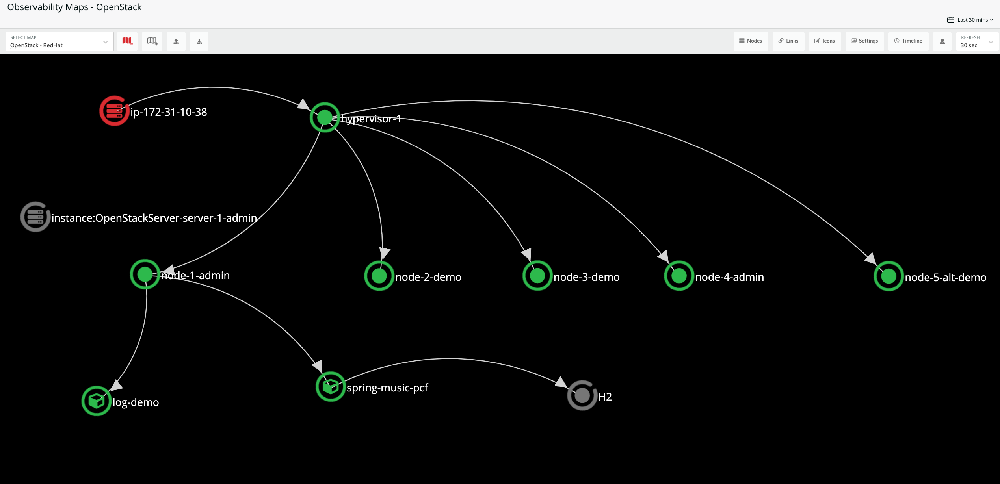
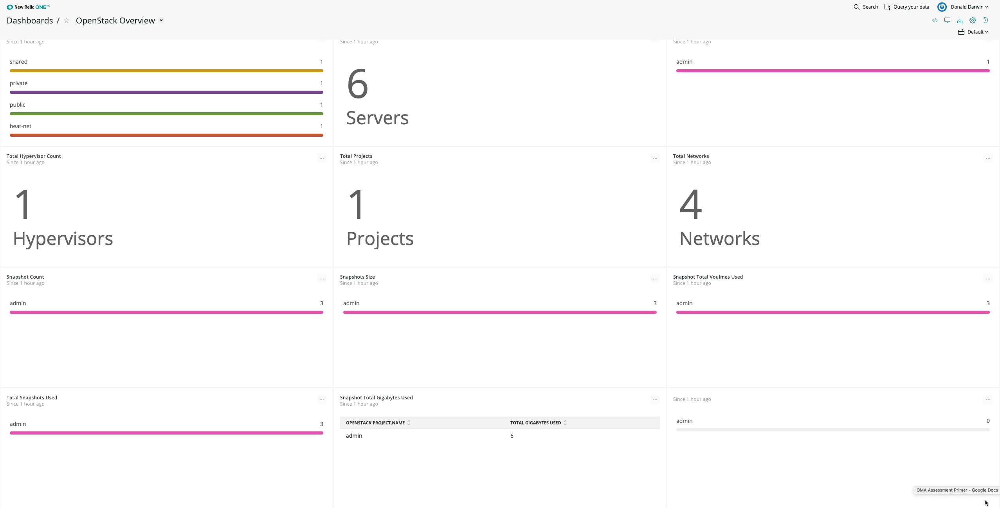
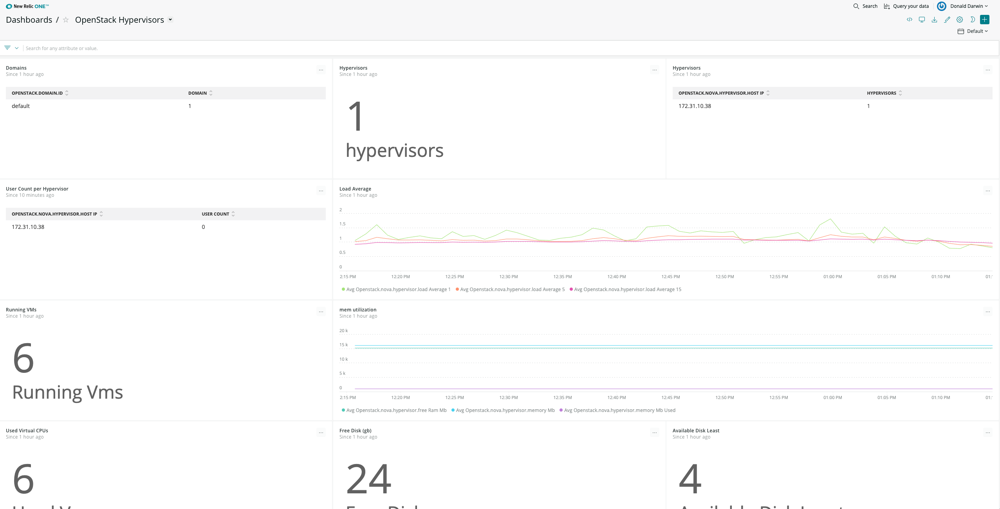
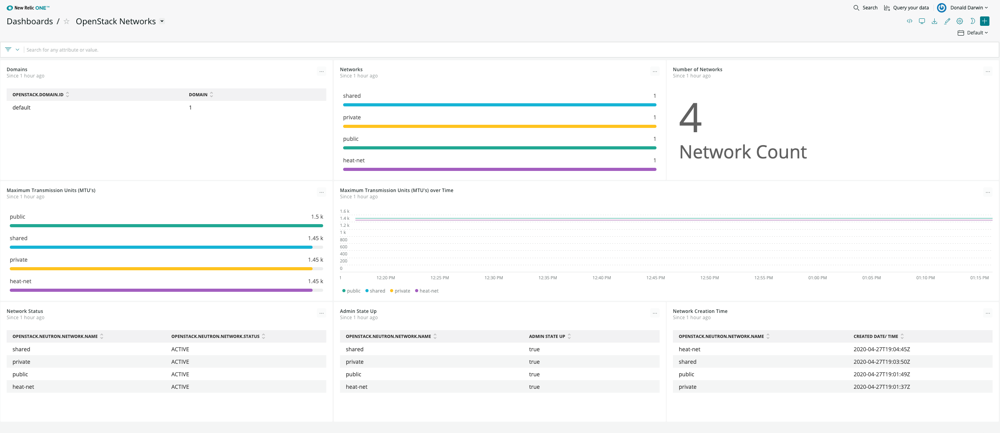
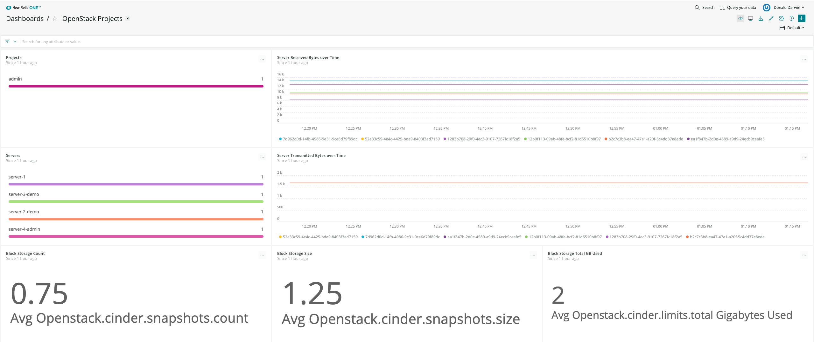
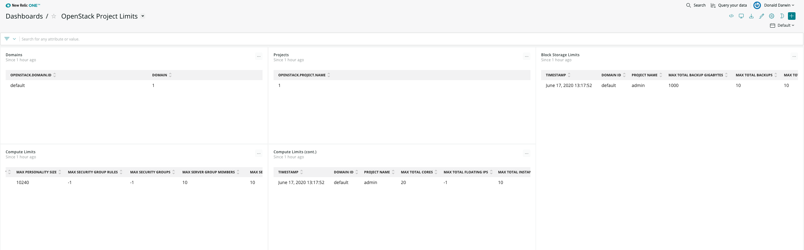

# New Relic OpenStack Integration - Usage

The data from OpenStack is collected via New Relic Infrastructure plus OpenStack on-host-integration (OHI) agent. The data from crucial OpenStack components/modules (Keystone, Nova, Neutron, Cinder, Hypervisors, Servers, Images, Resource Providers) flows into New Relic Insights to be used for Observability. There are 2 main uses for this telemetry:

* [Visualization](#visualization)
* [Alerting](#alerting)


---
## Visualization
You could view the data flowing from OpenStack in several different manners:

* [OpenStack High Density Nerdlet](#openstack-high-density-nerdlet)
* [OpenStack Workloads](#openstack-workloads)
* [Observability Map](#observability-map)
* [Dashboards](#dashboards)


---
### OpenStack High Density Nerdlet
The High Density Nerdlet allows you to drill down from the bare metal all the way to the application tunning on a node. This drill down could be performed in 2 different paths:

* <strong>Left Navigation:</strong> Baremetal -> Hypervisor -> VM Node (Server) -> Application
* <strong>Right Navigation:</strong> Domain -> Project -> VM Node (Server) -> Application


* All entitities in the high density dashboard follow the traffic light rules
* If any of the entities has alert condition(s) set, and the condition violates its threshold(s), the entity color changes according to the threshold values and conditions (green=healthy, yellow=warning, red=critical)


---
### OpenStack Workloads
The Workloads nerdlet allows you to build a workload for yourself with everything that is relevant to your job and responsibility. You can view the following data in a workload:
* APM (services / applications)
* Browser (frontend components)
* Mobile (mobile applications)
* Synthetics (test scripts)
* Infrastructure (servers, hosts, processes, all infrastructure resources)
* Kubernetes Clusters
* Lambda Functions
* Dashboards
* etc.




---
### Observability Map
The Observability Map shows the relationship of OpenStack components (hypervisors, nodes, etc.) and all the applications and services that are running on server nodes with each other. You could visualize all the components and see the relationships, the folow of data, component alerts, and more.



---
### Dashboards
The above OpenStack visualizations include links to a standard set of pre-defined dashboards built in the New Relic dashboard interface. Users can also create their own dashboards from the OpenStack events reported in New Relic Insights through the Chart Builder and Dashboard Editor. The pre-defined dashboards include:

---
**OpenStack Overview**: A summary of OpenStack health providing a overview of components including hypervisors, virtual machines, domains, projects, networks, and snapshots. 



---
**OpenStack Hypervisors**: Hypervisor status and resources including: user count; running VMs; CPU. memory, and disk utilization. 


---
**OpenStack Networks**: Network status including: network names, status, maximum transmission units, and admin state. 


---
**OpenStack Projects**: Overview of server resources by Project including: server names, I/O Bytes sent/received, and block storage.  


---
**OpenStack Project Limits**: Limits for block storage and compute resources by project. 


---
**OpenStack Servers**: server statistics including: network packets sent/received,  network packet errors sent/received, network packet drops sent/received.  


---
## Alerting
A default set of alerts is setup and can be imported using the script **"openstack-agent/alerts/create-openstack-policy.sh"**. Once imported, you could view the alerts and set proper thrsholds for your OpenStack environment, and add more conditions as necessary.

The alerts by default get created in a policy called **"OpenStack"**. Here is a list of the alert conditions that are created by the script:

*	APM

```
	- Deadlocked threads (Low)
	- Heap memory usage (High)
	- Apdex (Low)
```
*	Infrastructure

```
	- Hypervisor Load Average Fifteen Minute High
	- Hypervisor Load Average Five Minute High
	- Hypervisor Load Average One Minute High
	- VM % cpu utilized
```
*	Nrql

```
	- Server % free memory low
	- Hypervisor down
	- Hypervisor % free storage
	- hypervisor % memory used
```


---


